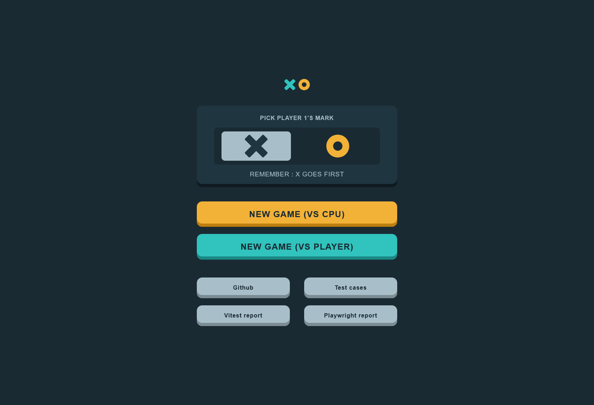
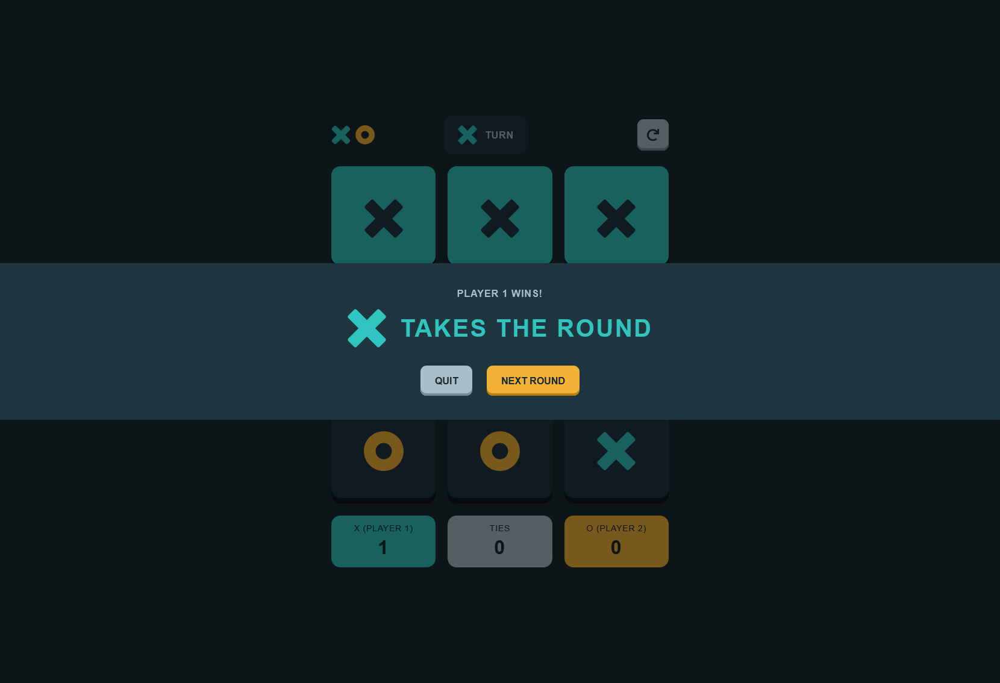

# Live demo

<https://tic-tac-toe-kwlodarczyk.netlify.app>

# Tic Tac Toe

 




Tic Tac Toe is a classic learning React app. Project is a frontend application containing unit and E2E tests and fully automated test cases.

Project is a solution for Frontend Mentor challenge: [Frontend mentor - Tic Tac Toe](https://www.frontendmentor.io/challenges/tic-tac-toe-game-Re7ZF_E2v)

## Tech stack

| Category         | Technology              |
| :--------------- | :---------------------- |
| **Frontend**     | React (JavaScript)      |
| **Styling**      | CSS Modules             |
| **E2E Testing**  | Playwright (TypeScript) |
| **Unit Testing** | Vitest                  |
| **CI/CD**        | GitHub Actions          |

## Key features

- Play in 2 modes: vs player or vs CPU
- Restart button to reset game stats and play again
- Showing game highlights under the game board
- Responsive app
- Saving data in local storage

## How to run

Recommended way is to use link from the top of this readme but you can also download the repository and use commands from command line:

```
  npm install
  npm run dev
```

E2E tests can be executed by commands:

```
npm install
npx playwright test --ui
```

## CPU moves algorithm

The app offers playing game vs other player or vs cpu. CPU uses rules of Minimax algorithm so it is also impossible to win with it.

CPU algorithm priority schema (higher number = higher priority):

1 - Occupy the middle field
2 - Occupy any corner field
3 - Block winning path if player has two fields in path
4 - Occupy field of the winning path if there is a possibility to win

## Continuous Integration

The project has configured Continuous Integration via Github Actions.
After each push or pull request, automated tests (Vitest and Playwright) are executed.

## Quality Assurance

The app has a strong QA approach. Quality assurance is proven by fully automated test cases combined with unit tests.

The project has two types of tests:

- Unit tests (Vitest)
- E2E tests (Playwright - TypeScript)

## Test cases

Test cases are written in JSON file and are parsed to html format. Test cases are available on the app by clicking button 'TEST CASES' located under the menu window.

### E2E tests

E2E tests check the user interface. Tests check distinct areas like menu window, game board or persistent state. There are 29 tests divided by the areas:

- load page
- menu interaction
- start game
- cpu moves algorithm
- restart button
- finish game
- local storage

Each area has their own test file (i.e. load-page.spec.ts).

Tests are written in PageObjectModel.
Pages are divided into:

- App.ts (check if the correct panel is shown)
- MenuPage.ts (actions on menu window like starting game, clicking player 1's mark, menu assertions)
- GamePage.ts (actions on game board like making moves, game board assertions)
- FinishGamePage.ts (actions on finish game panel and assertions like checking correct buttons text)

Tests location:

```
/e2e/tests
```

Pages location:

```
/e2e/pages
```

### Unit tests

Unit tests check the game logic (check if there is a winner after a move) and the cpu moves algorithm (check if cpu selects correct fields).

Tests use straightforward assertions like correct value or object returned from the functions (assertions 'toBe()' and 'toEqual()').

Tests are located in:

```
/utils/
```

gameLogic.test.js - 16 tests checking all possible combinations of winning paths and finishing game without the winner (a tie).

cpuMove.tests.js - 4 tests checking the correct cpu moves algorithm.
